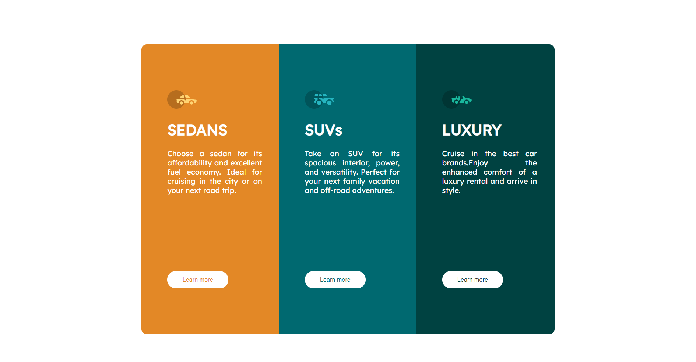
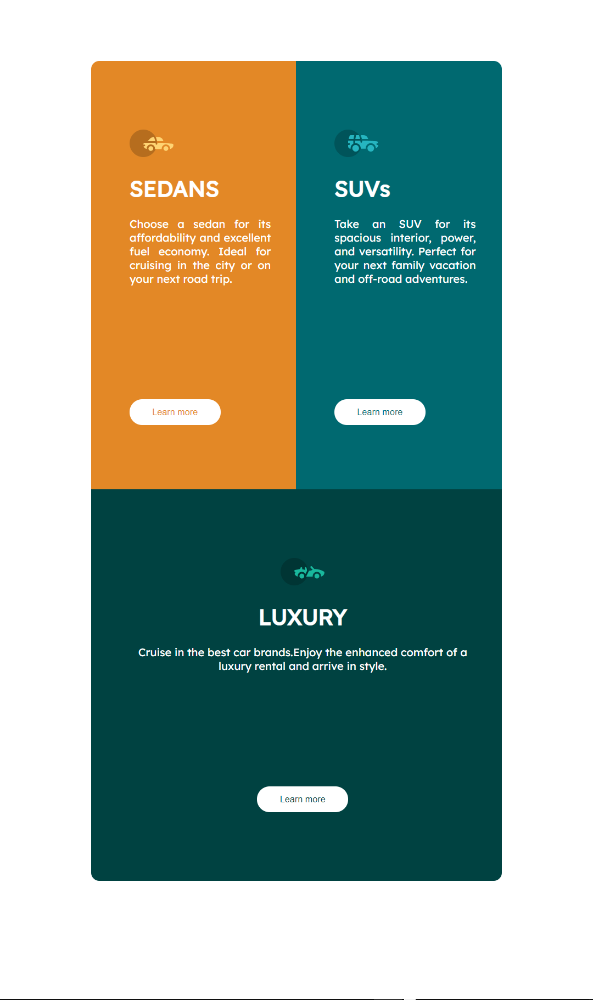
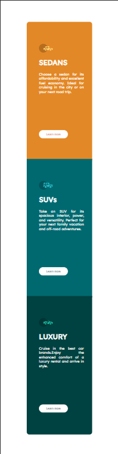

## Table of contents

- [Overview](#overview)
  - [The challenge](#the-challenge)
  - [Screenshot](#screenshot)
  - [Links](#links)
- [My process](#my-process)
  - [Built with](#built-with)
- [Author](#author)
- 

## Overview
   A 3-card design with responsive design and hovering effects on elements

### The challenge

Users should be able to:

- View the optimal layout depending on their device's screen size
- See hover states for interactive elements

### Screenshot
Solution in desktop size devices will look like this----> 
Solution in tablet/ipad size devices will look like this----> 
Solution in phone size devices will look like this----> 

### Links

- Solution URL: [click here to view file](index.html)
- Live Site URL: [click here for live preview](https://your-live-site-url.com)

## My process

### Built with

- Semantic HTML5 markup
- CSS custom properties

### author
-Hi, I am the author of this project, I enjoyed making this project to the end
                                                                 -Ritik Kashyap

